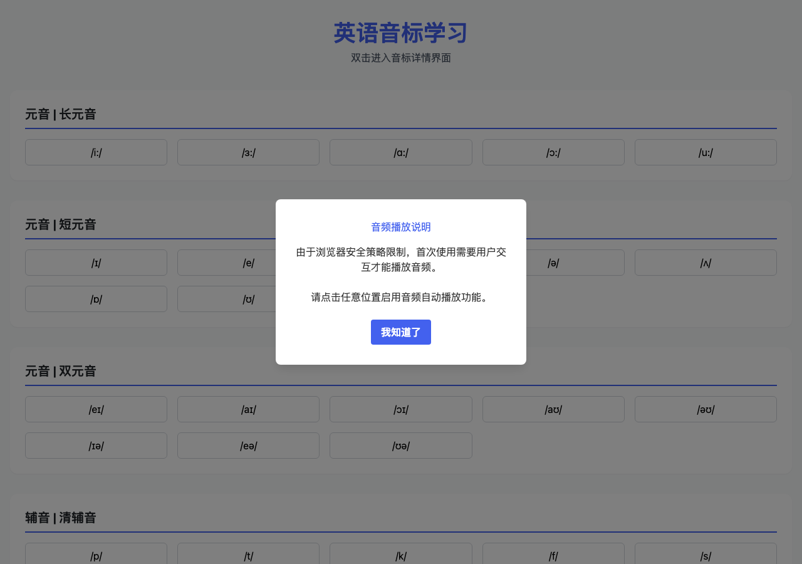

<p align="center">
  
</p>

<h1 align="center">英语音标学习</h1>

<p align="center">
  48 个英语音标 · 悬停自动播放发音 · 双击查看详情 · 示例单词发音
</p>

<p align="center">
  <a href="README-En.md">English</a> | 中文
</p>

<p align="center">
  <a href="LICENSE"></a>
  <a href="https://github.com/boommanpro/phonetic_symbol_web/actions"></a>
  
  
</p>

---

## 本地点击版（本项目）

在原项目基础上改造的**完全离线**版本，交互方式改为**点击**，更适合本地使用与手机访问：

- **点击音标** → 立即播放读音，底部弹出详情面板
- **详情面板** → 口型视频（原生播放控件）、3 个例词（点击听发音）、🔊 重播按钮
- **完全离线** → 去掉了 Tailwind / Font Awesome CDN 依赖，样式全部本地化（`style.css`），断网也能用
- **手机可用** → 移动优先响应式布局，同一 Wi-Fi 下手机浏览器直接访问

### 使用方式

```bash
# 方式一：直接双击 index.html（无需联网、无需服务器）

# 方式二：双击 start.bat（Windows），手机同 Wi-Fi 访问 http://<本机IP>:8000
# 等价命令：python -m http.server 8000 --bind 0.0.0.0
```

点击任意音标开始学习。ESC 键、点击遮罩或 ✕ 按钮关闭详情面板。

### 本地版文件说明

| 文件 | 说明 |
| --- | --- |
| `index.html` | 点击式学习页面（重写，原版见 git 历史 `git show HEAD:index.html`） |
| `style.css` | 本地样式（替代 Tailwind CDN） |
| `data.js` | 48 个音标的结构化数据（符号、分类、音视频路径、例词） |
| `start.bat` | Windows 一键启动局域网服务器 |

> 音标内容版权归 [英语音标网](https://www.yyybabc.com/) 所有，本项目仅供学习目的。

---

## 原项目介绍（悬停版）

`英语音标学习` 是一个帮助用户学习英语音标的互动网站，涵盖全部 **48 个英语音标**（20 个元音 + 28 个辅音），支持鼠标悬停自动播放发音音频，双击进入音标详情页面。

网站分类展示长元音、短元音、双元音、清辅音、浊辅音，每个音标配有示例单词并支持单词发音播放，帮助用户在语境中掌握音标。

### 核心场景

- 英语音标入门学习
- 纠正发音、对比练习
- 词汇发音查询

## 项目截图



## 在线演示

部署在 GitHub Pages：<https://boommanpro.github.io/phonetic_symbol_web/>

## 核心特性

- **48 个音标全覆盖** - 长元音、短元音、双元音、清辅音、浊辅音分类展示
- **悬停自动播放** - 鼠标悬停在音标按钮上自动播放音标音频（循环播放 3 次）
- **示例单词发音** - 悬停后显示示例单词列表，点击单词播放单词发音
- **双击查看详情** - 双击音标按钮跳转到音标详情学习页面
- **响应式设计** - 适配各种屏幕尺寸
- **自动下载脚本** - 提供 Python 脚本自动下载音标音视频与单词发音

## 技术栈

| 模块 | 技术 |
| --- | --- |
| 页面 | HTML5 |
| 样式 | Tailwind CSS v3（CDN） |
| 图标 | Font Awesome |
| 交互 | 原生 JavaScript |
| 资源下载 | Python（auto_download.py / extract_words.py） |

## 项目结构

```
phonetic_symbol_web/
├── index.html              # 主页面
├── phonetic_words.json     # 音标与单词映射数据
├── auto_download.py        # 音标音视频自动下载脚本
├── extract_words.py        # 单词提取与下载脚本
├── video/                  # 48 个音标视频文件 (phonetic-1~48.mp4)
├── words-voice/            # 单词发音文件 (word-xxx.mp3)
├── docs/                   # Logo、截图、favicon
└── .gitignore
```

## 快速开始

### 本地运行

无需安装依赖，直接用浏览器打开或启动本地服务器：

```bash
# 方式一：直接打开 index.html

# 方式二：Python 内置服务器
python3 -m http.server 8000
```

浏览器访问 <http://localhost:8000>

### 使用方式

1. 首次打开会弹出音频播放提示，点击「我知道了」启用音频
2. **鼠标悬停**音标按钮 → 自动播放音标音频（3 次）并显示示例单词
3. **点击示例单词** → 播放单词发音
4. **双击**音标按钮 → 跳转到音标详情学习页面

### 资源下载（可选）

如果需要重新下载音标音视频或单词发音：

```bash
# 下载 48 个音标的音频和视频
python auto_download.py

# 提取并下载单词发音
python extract_words.py
```

## 部署方式

### GitHub Pages（自动部署）

项目已配置 GitHub Actions 工作流（`.github/workflows/deploy.yml`），当推送到 `main` 分支时自动部署到 GitHub Pages。

手动部署流程：

1. 进入仓库 **Settings → Pages**
2. **Source** 选择 `GitHub Actions`
3. 推送代码到 `main` 分支即可触发自动部署

### 手动部署

由于项目是纯静态文件，可直接部署到任意静态服务器：

```bash
# 使用 Python
python3 -m http.server 8000

# 或使用 Nginx
docker run -d -p 80:80 -v $(pwd):/usr/share/nginx/html nginx
```

## 注意事项

- 由于浏览器自动播放策略限制，首次使用需点击页面启用音频
- 音标内容版权归 [英语音标网](https://www.yyybabc.com/) 所有，本项目仅供学习目的

## 贡献

欢迎提交 PR 贡献代码，例如：

- 增加更多示例单词
- 优化 UI 主题与动画
- 增加音标对比练习功能
- 支持离线使用

## 许可证

[MIT License](LICENSE)
